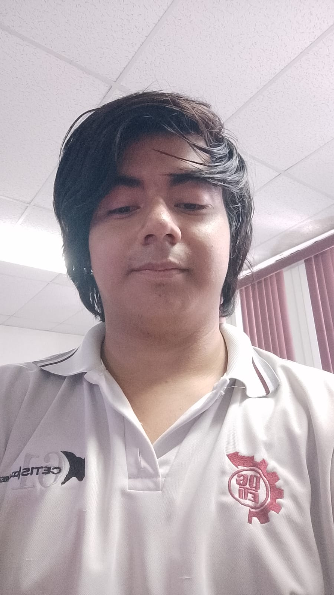

# Proyecto-Wiki-Niverso
## Immplementa Bases De Datos No Relacionales 4D

## Integrantes:
### Galindo Evan Alonso Escareño
### 24308060610646@cetis61.edu.mx

{ width="300px" }

### Jesus Cabrera Avila
### 24308060610607@cetis61.edu.mx

## Propocito del proyecto:
### En este proyecto buscamos crear un sitio web personal para poder ver informacion de comics que puedan ser de interes para el usuario, teniendo informacion de el nombre, fecha de publicasion, editorial, autor, artista, personajes y donde se puede comprar. y se da la opcion al usuario para poder incluir y modificar la informacion de nuevos comics. 

## NGROK 
## es una herramienta que crea un túnel seguro entre Internet y tu computadora local. Sirve para exponer un servidor local (Flask, FastAPI, Node, etc.) a Internet sin configurar routers ni IP pública.

## Comandos de descarga:
### uv add flask flask-mail itsdangerous bcrypt pymongo dnspython
### ngrok http 5000
### ngrok config add-authtoken TU_TOKEN
